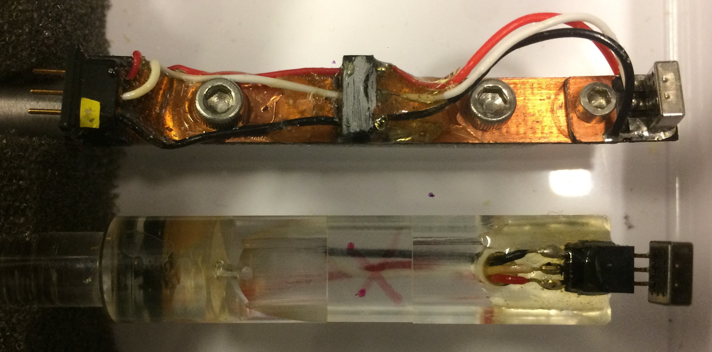

# Calibration of auditory stimuli delivery setup

Notes on the calibration of auditory stimuli

## Hardware:

* **Stimuli delivery**
    * 2-channel amplifier (Crown D-75A).
    * Headphone speaker (KOSS, 16 Ohm impedance; sensitivity, 112 dB SPL/1 mW).
    * Coupling tube (length: 20 cm, diameter: 1 mm).

Sound is produced using matlab --> DAQ (analog output) --> amplifier --> headphone --> tubing

* **Measurement of stimuli**
    * Calibrated pressure gradient microphone (NR23159, Knowles Electronics Inc., Itasca, IL, USA) for calibration of intensity.

    * Pressure microphone (4190-L-001, Bruel & Kjaer) to calibrate the power spectrum.
    * Microphone Preamplifier (MicPre 2.1, Bio-electronics Shop 2013).

    * Soundproof box for calibration.

Sound is measured using:

- NR-23159 --> Microphone Preamplifier --> DAQ
- 4190-L-001 --> DAQ

## Calibrate power spectrum

For an example of estimating the transfer function of the system see: demo_get_transferfunction
